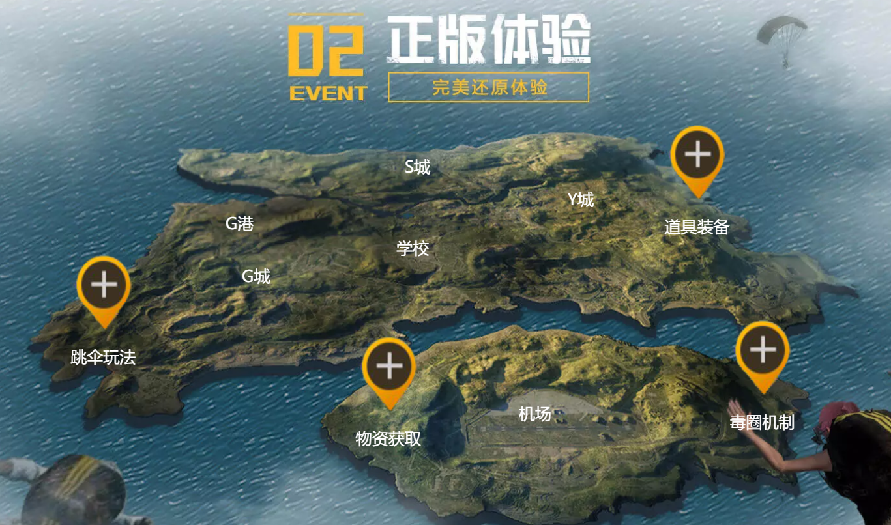

# wegame-imitation

[TOC]


## 简介

> 实战demo
>
> 1. 基于【**HTML+CSS**】纯静态实现模仿【刺激战场】游戏官网的web网页。
> 2. 基于【**HTML+CSS+JS**】模仿【WeGame】的web网页。
> 3. 基于“一起来捉妖”的官网，使用【**jQuery+BootStrap+Local Storage+JSON**】实现类似于mysql的浏览器存储（增删改查）。
>
> 本项目为学习【JS阶段】和【jQuery+BootStrap阶段】两个阶段的实战demo。
>
> *本demo开发很早，还存在很多的优化空间/问题*。

### 特色

- HTML+CSS的基础静态网页（模仿刺激战场官网），包含常用的基础网页结构
- CSS效果——轮播图、选项卡、各种动画、过渡
- 基于JS实现的常用原生动效——轮播图、旋转木马、动画、雪花飘落动效
- 基于JS实现的小游戏（详情可参看另一个仓库：[plane-wars-gaming](https://github.com/duktig666/plane-wars-gaming)）
- 以《一起来捉妖》游戏官网为原型，自行设计，实现类似于mysql的对“妖灵”增删改查功能

## 文件夹结构

```
- doc 描述文档文件
- stimulate-battlefield（【HTML+CSS纯阶段】静态实现的内容和CSS动效）
	-- css 
	-- html
	-- images 图片资源
	-- vedio 短视频资源
	-- index.html 入口文件
	-- public-footer.html 公共头部文件
	-- public-header.html 公共尾部文件
- wegame-imitation （【JS和jQuery+BootStrap阶段】）
	-- audio 音频资源
	-- css 
	-- html
	-- images 图片资源
	-- js
		--- common.js 封装公共的js代码
	-- vedio 短视频资源
	-- index.html 入口文件
```

- 文件/文件夹以`demon`的为【**jQuery+BootStrap+Local Storage+JSON**】实现的类似于mysql的浏览器存储（增删改查）功能。
- 文件/文件夹以`virus`的为js实现的飞机大战功能。小游戏可参看另一个仓库：[https://github.com/duktig666/plane-wars-gaming](https://github.com/duktig666/plane-wars-gaming)

## 部分示意图

### 纯CSS效果

#### 纯CSS实现轮播图和选项卡


#### CSS动画




### JS阶段（JS相关动效）

#### 网页头部及轮播图动效


#### 热点预告板块


#### 旋转木马式视频播放


#### 雪花飘落及不规律动画效果


*其余功能不一一介绍*

### jQuery+BootStrap阶段（模拟增删改查）

#### 添加妖灵


#### 栅格系统的排列方式


#### 修改、删除、搜索妖灵


#### 基于BootStrap实现的各种插件和效果


## 优化空间

- 开发尚早，未实现响应式


